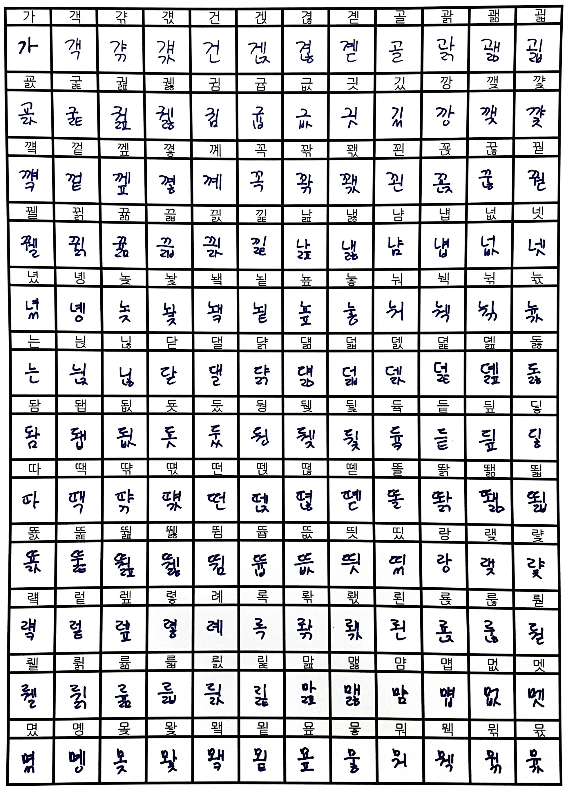
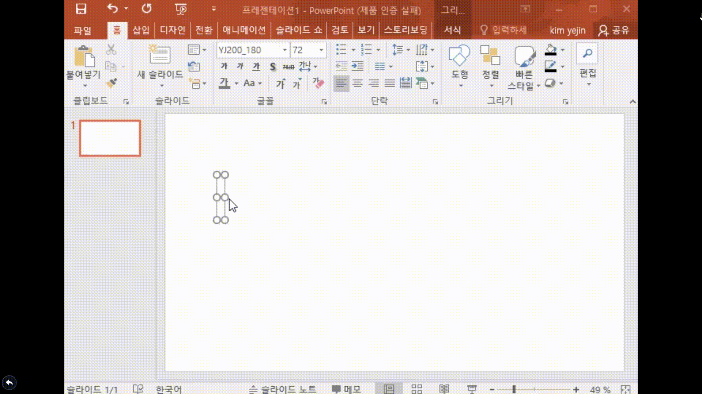
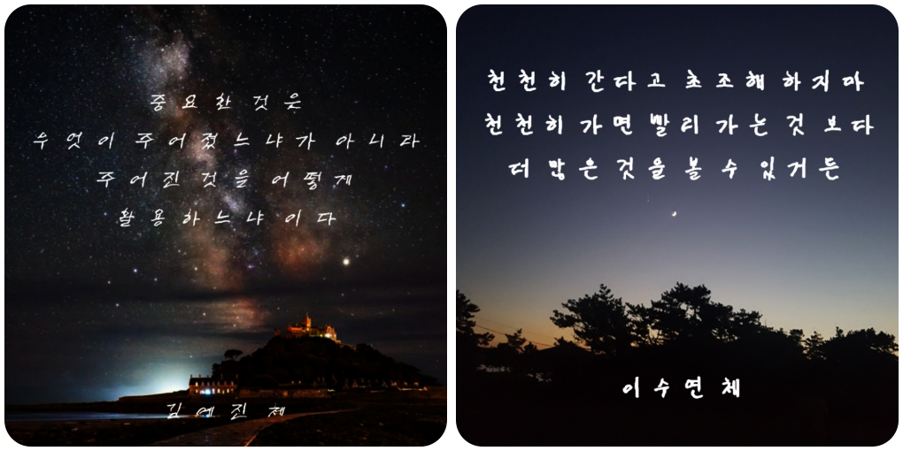

# 19-12-FONT
2019년 캡스톤 디자인 - 사용자 필적 맞춤형 폰트 생성 서비스

## 개요
한글 폰트 제작의 어려움을 덜기 위해, 사용자가 작성한 글자 디자인의 특성을 `GAN`이라는 딥러닝 기술을 이용하여 학습한 후, 나머지 한글 글자 이미지들을 자동 생성하여 **자신만의 손글씨 폰트를 만들어 제공합니다.**

[실행 영상](https://youtu.be/BNyDWL3kBX8)

## 개발 환경
```
Ubuntu 16.04
Nvidia GTX 1060
CUDA 10.0
CUDNN 7.4.1
tensorflow 1.14.0
python 2.7.x
```
## 동작
```shell
# 패키지 설치
npm install
```

```shell
# 한글 폰트 사용을 위한 처리 작업
cp public/javascripts/os2.js node_modules/svg2ttf/lib/ttf/tables/.
```

```shell
# 학습된 모델 다운 & 압축해제 & 덮어쓰기
.
├── font_python
│   ├── baseline
│   │   └── checkpoint
│   │       └── experiment_0_batch_16
│   │           ├── checkpoint
│   │           ├── unet.model-107850.data-00000-of-00001
│   │           ├── unet.model-107850.index
│   │           └── unet.model-107850.meta
 
```
[Download PreTrained Model](https://drive.google.com/file/d/1uLGAyY7zXUi2BHuc90-ILw-IgawVcsZ8/view?usp=sharing)


```shell
# 실행하기
node app.js
```

```
# 템플릿 다운 및 손글씨 작성
.
├── template
│   ├── 1-unifrom.png
│   ├── 2-uniform.png
│   └── 3-uniform.png
```

### 작성된 템플릿 예시<br>



## 세부 동작

### 글자 영역 추출
``` shell
# crop
python 01_crop.py --src_dir=[템플릿 폴더 경로] --dst_dir=cropped_dir --txt=399-uniform.txt
```
</center>

### paired data 생성
```shell
# font2image
python 02_font2image.py --src_font=NanumGothic.ttf --dst_font=NanumGothic.ttf --sample_dir=pair_dir/ --handwriting_dir=cropped_dir/
```

### object data 생성
```shell
# package
python 03_package.py --dir=pair_dir/ --save_dir=package_dir
```

### 손글씨 학습 - 1
```shell
# train - 01
python2 04_train.py --experiment_dir=experiment/ --experiment_id=0 --batch_size=16 --lr=0.001 --epoch=60 --sample_steps=100 --schedule=20 --L1_penalty=100 --Lconst_penalty=15 --freeze_encoder=1
```

### 손글씨 학습 - 2
``` shell
# train - 02
python2 04_train.py --experiment_dir=experiment/ --experiment_id=0 --batch_size=16 --lr=0.001 --epoch=120 --sample_steps=100 --schedule=40 --L1_penalty=500 --Lconst_penalty=1000 --freeze_encoder=1
```

### 학습한 모델을 통해 나머지 손글씨 이미지 추출
``` shell
# infer
python2 05_infer.py --model_dir=experiment/checkpoint/experiment_0_batch_16 --batch_size=1 --source_obj=experiment/data/val.obj --embedding_ids=0 --save_dir=experiment/inferred_result --progress_file=experiment/logs/progress
```

### 생성된 이미지 폴더 옮기기
```shell 
.
├── FONT
│   ├── inferred_result

```

### 폰트 파일로 변환
``` shell
# generateTTF.js
node generateTTF.js
```

## 폰트 적용
</center>
</center>

## 참고
https://github.com/kaonashi-tyc/zi2zi<br>
https://github.com/periannath/neural-fonts<br>
https://github.com/yjjng11/Neural-fonts-webapp<br>